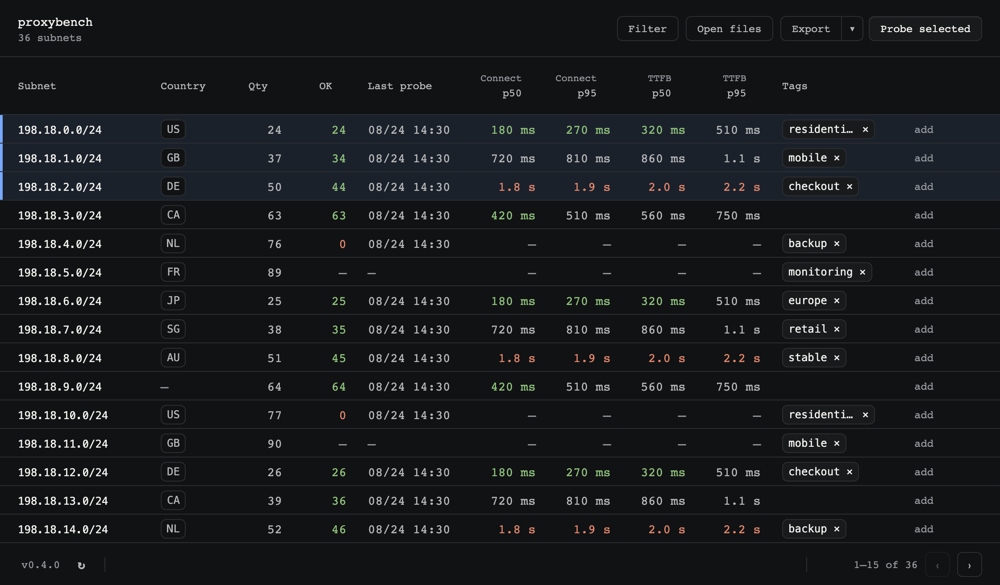

  
  <h1>proxybench</h1>
  

    Split an HTTP proxy list by subnet and measure how quickly each
    <code>/24</code> connects and receives response headers.
  

  

  <a href="#install">Install</a>
  ·
  <a href="#use">Use</a>
  ·
  <a href="#what-the-numbers-mean">Numbers</a>

  

## What it does

proxybench is a small desktop app. Drop a list of HTTP proxies, get one row
per IPv4 `/24`, probe them against one HTTPS URL, and export the lists you
want to keep.

It does not judge whether a site accepted the request. A `200` and a `403`
are both a valid speed sample: headers arrived. Response bodies are never
read.

## Install

You do not need Git, GitHub, or a developer setup.

1. Open the [latest release](https://github.com/Mathious6/proxybench/releases/latest).
2. Download the file for your computer.

| Your computer                           | File to download             |
| --------------------------------------- | ---------------------------- |
| Mac with Apple Silicon (M1, M2, M3, M4) | macOS **arm64** `.dmg`       |
| Mac with Intel                          | macOS **x64** `.dmg`         |
| Windows 10 or 11                        | Windows **x64** setup `.exe` |

On a Mac, open the DMG, drag **proxybench** into Applications, then open it
normally. MacOS builds are Developer ID signed and notarized by Apple.

On Windows, run the setup wizard. If SmartScreen appears, choose **More
info**, then **Run anyway**. Windows needs WebView2; Windows 10 and 11
usually already have it. Windows installers are unsigned.

## Use

1. Drop a `.txt` file or a folder of `.txt` files onto the window, or click
   **Open files**. New `/24`s are added; existing ones keep their lines and
   gain any new ones. The store survives a restart.
2. One HTTP proxy per line (eg. `192.0.2.10:8080:username:password`). Blank
   lines and `#` comments are ignored. Anything else is skipped. Imported
   lines, including credentials, are stored unencrypted in the app's local
   data directory.
3. Rows appear immediately, one per IPv4 `/24`. Country is looked up in
   batches from one listed IP per missing `/24` through
   [country.is](https://country.is). Each Probe refreshes and saves the country
   for every `/24` it covers before starting the speed measurements. If a
   lookup fails, **Refresh countries** re-runs the lookup and saves the result.
4. Tag subnets if you want. Tags are stored on this computer by CIDR and
   survive the next import. Click a column header to sort. **Filter** sits
    with Open files, Refresh countries, Export, and Probe all. The table shows 15 subnets per
    page. Click a row to select it; Command-click on macOS or Ctrl-click on
    Windows toggles rows, and Shift-click selects the sorted and filtered
    range across pages; add Command/Ctrl to extend that range. Command/Ctrl-A
    selects all filtered rows, and Escape clears the selection. Selected rows
    persist while sorting and filtering.
    Probe progress and the app version sit in the bottom bar. Right-click a
    selected row to Probe or Export the selection, or any row to act on only
    that row; Remove always removes only that row.
5. **Probe all**, selected rows, or one row. Paste one HTTPS URL the first time; it
   is remembered. Each proxy is probed once with a 5 second timeout. The
   table fills with OK, Connect, TTFB (p50 and p95), and Last probe. Those
   stats survive a restart. Adding proxies to a `/24` drops its last probe.
   Failures are omitted from those timings.
6. **Export** writes one `.txt` per selected subnet, or every subnet when none
   is selected, source lines verbatim:
   `[{tags}_]{CC}_{IP}_24_{qty}.txt`. Example:
   `isp-mobile_FR_192.0.2.0_24_42.txt`. No tags means the filename starts
   with the country code. No country means `XX`.
   The adjacent export menu also offers **Export for AYCD (.json)**, which writes
   one categorized JSON file for the same scope.

Run a probe once, then pause. Back-to-back runs saturate your own uplink
and inflate every subnet.

## What the numbers mean

| Column     | Meaning                                                                                      |
| ---------- | -------------------------------------------------------------------------------------------- |
| Qty        | Proxies imported in that `/24`.                                                              |
| OK         | Probes that returned origin headers within 5 seconds.                                        |
| Last probe | When that `/24` last finished a Probe run.                                                   |
| Connect    | Time from dialing the proxy until HTTP CONNECT returns `200` (tunnel up, before origin TLS). |
| TTFB       | Time from that same start until origin HTTPS headers arrive.                                 |

Each probe uses a fresh TCP connection. Reuse would zero Connect.

Connect and TTFB cells show milliseconds (or seconds above one second).
Under 500 ms is green, over 1500 ms is red. OK is green at 80% success and
red below 30%. That colour is emphasis, not a score.

## Not this tool

- Not a bypass tester, quality score, or anti-bot oracle.
- Not SOCKS, not proxy URLs, not extra line formats.
- Not a multi-target lab. One URL per run.
- Does not download bodies. Does not report status codes or error types.

## License

MIT.
